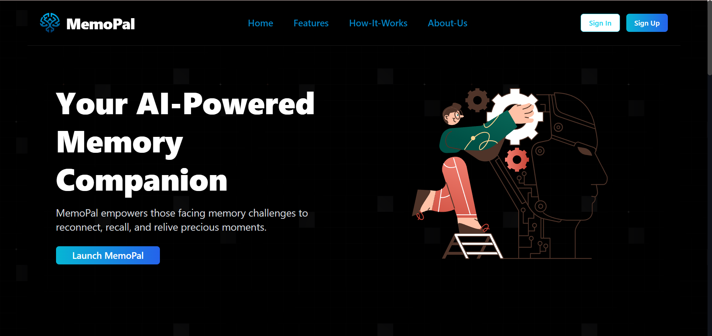
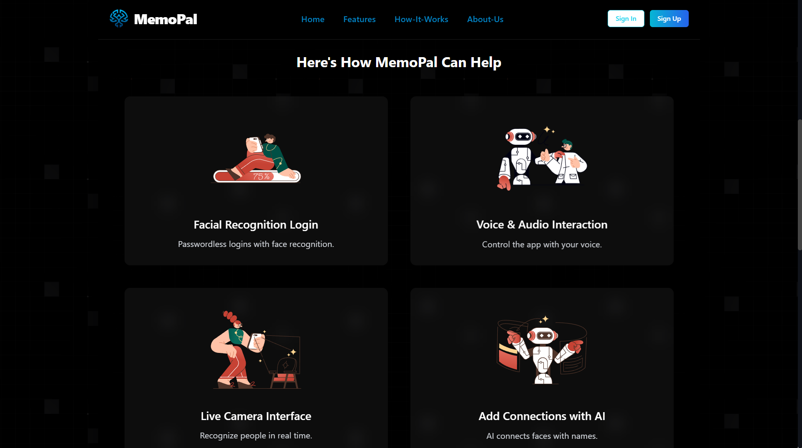
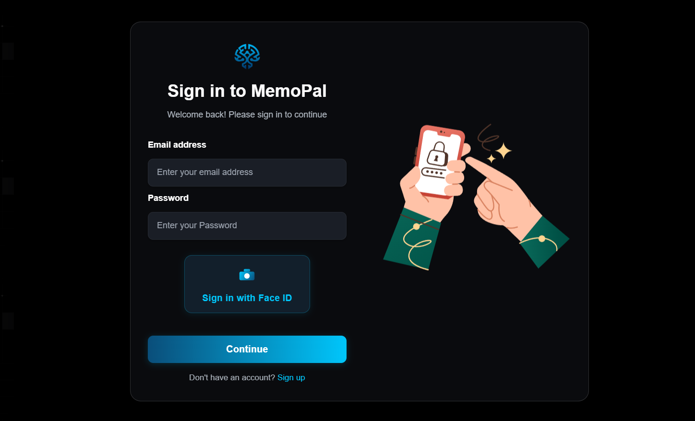

# MemoPal

<p align="center">
  
</p>

<p align="center">
  <strong>Your personal memory companion</strong>
</p>

## 📸 Screenshots

<p align="center">
  
  <p align="center"><em>Landing Page of the Website</em></p>
</p>

<p align="center">
  
  <p align="center"><em>Features of MemoPal</em></p>
</p>

<p align="center">
  
  <p align="center"><em>Sign in Via Facial Recognition</em></p>
</p>

## 🌟 Overview

MemoPal is an innovative application designed to help you capture, organize, and recall your daily experiences. Using advanced facial recognition and natural language processing, MemoPal creates a personalized memory journal that's easy to navigate and search.

## ✨ Features

- **Facial Recognition**: Automatically identifies users through the camera
- **Memory Journaling**: Quickly record thoughts, experiences, and emotions
- **Intelligent Search**: Find specific memories based on content, date, or emotion
- **Beautiful UI**: Intuitive and responsive design for seamless user experience
- **Cross-platform**: Works on desktop and mobile devices

## 🛠️ Tech Stack

### Frontend
- React 19
- Vite
- Tailwind CSS
- React Router
- Shadcn UI Components

### Backend
- Python
- Face Recognition
- Flask
- SQLite Database

## 👥 Team

| Name | Role | GitHub |
|------|------|--------|
| SURESH M | Frontend Developer | [Suresh](https://github.com/SURESH-M-CHOUDHARY) |
| Vaibhav Kumar | Backend Developer | [Vaibhav](https://github.com/username2) |
| Aneesha Mishra | UI/UX Designer | [Aneesha](https://github.com/aneesha1503) |
| Vishal Bhardwaj | OpenCV Engineer | [Vishal](https://github.com/VishalBharadwaj) |

## 📋 Prerequisites

- Node.js (v18+)
- Python (v3.8+)
- pip
- Git

## 🚀 Installation

### Clone the repository

```bash
git clone https://github.com/Vaibhavk121/Memopal-Brinhack.git
cd "MemoPal-Brinhack"
```
### Backend Setup

```bash
cd backend
pip install -r requirements.txt
```

### Frontend Setup

```bash
cd frontend
npm install
```

## 🖥️ Usage
### Start the Backend
```bash 
cd backend
python -m venv myenv
myenv\Scripts\activate
python app.py
```
The backend server will start at http://localhost:5000 .

### Start the Frontend

```bash
cd frontend
npm run dev
```
The frontend development server will start at http://localhost:5173 .

## 📁 Project Structure
```plaintext
MemoPal/
├── .git/
├── .gitignore
├── backend/
│   ├── app.py                # Main Flask application
│   ├── database.py           # Database models and connections
│   ├── face_recognition_utils.py  # Face recognition functionality
│   ├── myenv/                # Python virtual environment
│   ├── static/               # Static files and uploads
│   └── templates/            # HTML templates
└── frontend/
    ├── public/               # Public assets
    ├── src/                  # React source code
    ├── index.html            # HTML entry point
    ├── vite.config.js        # Vite configuration
    ├── tailwind.config.js    # Tailwind CSS configuration
    └── package.json          # Node dependencies
```    

## 🤝 Contributing
Contributions are welcome! Please feel free to submit a Pull Request.

1. Fork the repository
2. Create your feature branch ( git checkout -b feature/amazing-feature )
3. Commit your changes ( git commit -m 'Add some amazing feature' )
4. Push to the branch ( git push origin feature/amazing-feature )
5. Open a Pull Request
## 📄 License
This project is licensed under the MIT License - see the LICENSE file for details.

